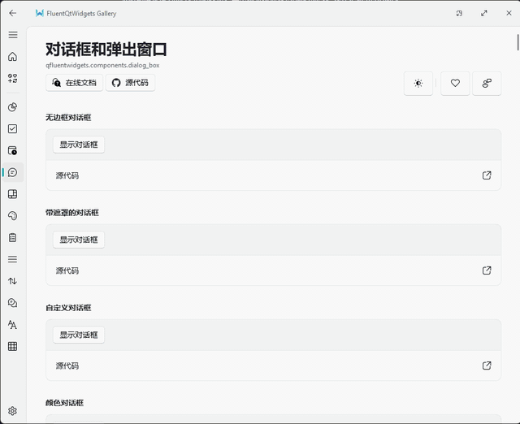

# FluentQtWidgets

[](https://github.com/txp666/FluentQtWidgets/actions/workflows/ci.yml)
[](https://github.com/txp666/FluentQtWidgets/releases)
[](LICENSE)

FluentQtWidgets 是一个面向 C++/Qt Widgets 的 Fluent Design 风格控件库，包含可复用控件、独立示例和完整的 Gallery 应用。

本项目是 Python 版 [PyQt-Fluent-Widgets](https://github.com/zhiyiYo/PyQt-Fluent-Widgets) 的 **C++/Qt Widgets 移植版本**。Python 原版是本仓库的行为与视觉基准：控件状态、间距、QSS 常量、示例内容、资源路径、Gallery 页面结构和翻译均尽量对齐上游实现；只有 Qt/C++ 平台行为存在差异时才保留必要调整。

当前发布线：**0.1.6**。本地参考源码、构建目录和开发 agent 元数据不会进入源码发布包。

## Gallery 截图



## 应用案例

- [Fluent 串口助手](https://github.com/txp666/FluentSerialAssistant) - 基于 Qt 6 和 FluentQtWidgets 构建的串口调试工具，覆盖串口连接、RX/TX 终端显示、记录导出、主题切换和三平台发布打包。

## 环境要求

- CMake 3.21+
- C++17
- Qt 6.5+（Core、Gui、Widgets、Svg、Network）
- 可选 Qt 模块：
  - Multimedia + MultimediaWidgets
  - WebEngineWidgets，仅独立 WebEngine 示例需要

## 构建

```bash
cmake -S . -B build -DFQW_BUILD_EXAMPLES=ON -DFQW_BUILD_TESTS=ON
cmake --build build --parallel
ctest --test-dir build --output-on-failure
```

### 安装 / 引用

```bash
cmake --install build --prefix <install-prefix>
```

```cmake
find_package(FluentQtWidgets CONFIG REQUIRED)
target_link_libraries(my_app PRIVATE FluentQtWidgets::Widgets)
```

### Windows Qt Kit 选择

CMake 使用的编译器和生成器必须与已安装的 Qt kit 匹配。MinGW Qt kit 应使用 MinGW 构建，MSVC Qt kit 应使用 MSVC 构建。如果 CMake 提示找不到 `Qt6Config.cmake`，请通过 `CMAKE_PREFIX_PATH` 指向 Qt kit 根目录，或将 `Qt6_DIR` 设置为包含 `Qt6Config.cmake` 的目录。

仓库内的 `CMakePresets.json` 不写死本机 Qt、编译器或调试器路径。机器相关配置应放在环境变量、IDE kit 选择，或被忽略的 `CMakeUserPresets.json` 中。仓库提供 `CMakeUserPresets.json.example` 作为本地配置模板。

使用本机 Qt MinGW kit 时，先让 Qt kit、MinGW 编译器和 Ninja 对当前终端可见，再使用仓库内的 `mingw-debug` preset：

```powershell
$env:CMAKE_PREFIX_PATH = "<path-to-qt-mingw-kit>"
$env:Path = "<path-to-mingw-bin>;<path-to-ninja-dir>;<path-to-qt-bin>;$env:Path"

cmake --preset mingw-debug
cmake --build --preset mingw-debug --parallel
ctest --preset mingw-debug
```

VS Code 任务会继承启动 VS Code 时的环境。要使用一键构建，可以从已经设置好上述变量的终端启动 VS Code，设置等价的用户环境变量，或复制 `CMakeUserPresets.json.example` 为被忽略的 `CMakeUserPresets.json` 并填入本机路径。Windows 下的 `Gallery: Debug` 使用 `gdb.exe`，因此启动调试前 VS Code 必须能从 PATH 找到 MinGW 的 `bin` 目录。

重新构建前请先关闭正在运行的 Gallery 窗口，否则链接器无法覆盖正在运行的 `.exe`。如果看到 `ninja: error: loading 'build.ninja': The system cannot find the file specified.`，请先运行 `cmake --preset mingw-debug` 重新生成 `build/mingw/build.ninja`，再执行构建。如果 PowerShell 显示重复的 `PATH`/`Path` 环境变量，请先启动干净终端或修正用户环境，否则 MinGW 工具可能没有编译器诊断就失败。

如果使用 Visual Studio/MSVC，请安装匹配的 Qt MSVC kit，并将 `CMAKE_PREFIX_PATH` 或 `Qt6_DIR` 指向该 kit。不要提交本机的 `CMakeUserPresets.json`。

### 启动 Gallery

使用与当前平台匹配的 preset。不同平台使用独立构建目录，因为 CMake 会把生成器、编译器和 Qt kit 缓存在构建目录中。

```bash
# macOS/Linux
cmake --build --preset debug --target FluentQtWidgetsGallery --parallel
./build/debug/examples/gallery/FluentQtWidgetsGallery
# macOS:
# open ./build/debug/examples/gallery/FluentQtWidgetsGallery.app
```

```powershell
# Windows MinGW
cmake --build --preset mingw-debug --target FluentQtWidgetsGallery --parallel
.\build\mingw\examples\gallery\FluentQtWidgetsGallery.exe
```

## 独立示例

macOS/Linux 使用 `--preset debug`，Windows MinGW 使用 `--preset mingw-debug`：

```bash
cmake --build --preset debug --target fqw_basic_input_button_demo --parallel
cmake --build --preset debug --target fqw_basic_input_check_box_demo --parallel
cmake --build --preset debug --target fqw_basic_input_combo_box_demo --parallel
cmake --build --preset debug --target fqw_basic_input_model_combo_box_demo --parallel
cmake --build --preset debug --target fqw_basic_input_radio_button_demo --parallel
cmake --build --preset debug --target fqw_basic_input_slider_demo --parallel
cmake --build --preset debug --target fqw_basic_input_switch_button_demo --parallel
```

全部示例目标可从各 `examples/` 子目录的 `CMakeLists.txt` 查看。

## Gallery 更新（OTA）

Gallery 使用 CMake 项目版本号 `project(... VERSION ...)` 做版本展示和更新比较。默认更新通道是 GitHub Releases。标签、资产和校验规则见 [发布与 OTA](docs/release.md)。

## 文档

- [快速开始](docs/quick-start.md)
- [发布与 OTA](docs/release.md)
- [API 路线图](docs/api-roadmap.md)
- [基础控件](docs/controls-basic.md)
- [架构设计](docs/architecture.md)
- [移植指南](docs/porting-guide.md)
- [贡献指南](CONTRIBUTING.md)

## 构建辅助脚本

- `scripts/generate_vscode_examples.py` 生成 `.vscode/tasks.json` 和 `.vscode/launch.json`。
- `scripts/run_example.py`（如存在）可按生成的示例清单运行 demo target。

## 主题范围

本仓库聚焦 Fluent 风格的 Qt Widgets 控件：

- 按钮和工具按钮，包括分裂按钮、下拉按钮和切换按钮
- 菜单、对话框、浮层和弹出层
- 导航和布局控件
- 编辑器、选择器、信息反馈组件
- 图表、实时曲线和波形显示
- 表格、树、列表和滚动区域
- 基础 Material 辅助组件

## 许可

本项目以 **GPL-3.0-or-later** 发布。上游来源与资源授权见 [Third Party Notices](THIRD_PARTY_NOTICES.md)。
